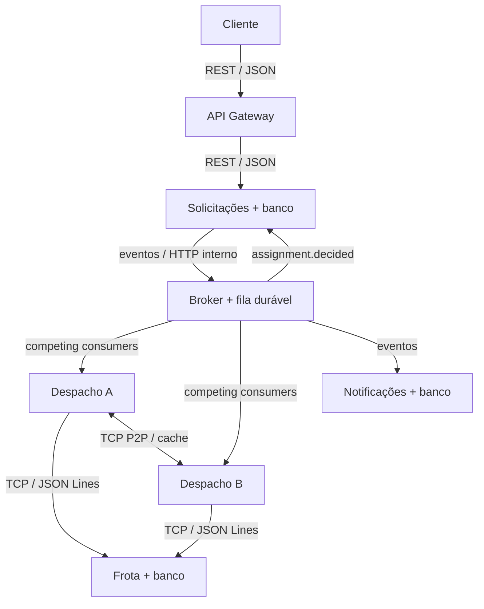

# Documentação técnica — ARP 01: Gestão de frotas logísticas

**Disciplina:** Arquiteturas de Sistemas Distribuídos · **Instituição:** UniEVANGÉLICA · **Autora:** Anny Gabrielly Gonçalves de Oliveira · **Matrícula:** 2310019 · **Fase:** 01

## 1. Contexto e problema

Uma transportadora recebe pedidos de transporte e precisa alocar veículos compatíveis com o peso da carga. O solicitante quer registrar o pedido sem esperar a alocação e consultar o andamento. A entidade central é a **solicitação de transporte** (`request_id`); `origin`, `destination` e `cargo_kg` descrevem sua necessidade. O sistema entrega uma demonstração local: frota inicial de três caminhões e alocação por menor capacidade suficiente, sem cálculo de rota, geolocalização, motorista ou liberação posterior do veículo.

**Objetivo:** registrar uma solicitação via REST, processar alocação em segundo plano, registrar uma notificação interna e publicar mudanças de status, mantendo rastreabilidade e tolerância a falhas de consumidores.

**Atores:** solicitante (cliente HTTP); operador (consulta diagnósticos internos somente em ambiente local); serviços autônomos de processamento.

**Taxonomia:** predominantemente **sistema distribuído de informação**, pois coordena pedidos, estados e alocações persistidos. O cálculo simples de seleção do veículo é uma capacidade computacional, mas não caracteriza HPC; não há sensores IoT, logo o protótipo não é pervasivo.

## 2. Arquitetura

O cliente web incluído acessa apenas o gateway (cliente-servidor). Os serviços Solicitações, Frota, Despacho e Notificações separam capacidades; Solicitações, Frota e Notificações possuem arquivos SQLite próprios. As duas instâncias de Despacho são stateless no processamento principal e mantêm apenas um cache local volátil. O broker possui seu próprio SQLite, com cópias independentes por assinatura. A publicação e o consumo usam HTTP/JSON na rede interna do Compose ou em `127.0.0.1` com `npm run dev`; além desse transporte, Despacho ↔ Frota e Despacho ↔ Despacho usam sockets TCP brutos com mensagens JSON terminadas por `\n`. Os pares se descobrem por nomes DNS do Compose ou pelo endereço local com portas configuradas e fazem `hello` periodicamente; a replicação de cache ocorre diretamente sem gateway.

**Justificativas:** REST facilita consumo pelo cliente e códigos HTTP explícitos; TCP/JSON Lines mostra uma operação síncrona interna com baixo overhead e enquadramento de mensagens; a troca P2P oferece cooperação observável entre instâncias idênticas; uma fila por assinatura isola os consumidores e permite que duas instâncias de Despacho disputem mensagens da mesma fila. Um broker durável separa emissão e consumo no espaço (assinaturas pelo nome), tempo (persistência) e fluxo (criação não aguarda processamento). A solução prioriza transparência didática; gRPC tipado seria adequado para contratos maiores.

### Fluxo e estados

1. POST no gateway autentica e encaminha o JSON. Solicitações valida, gera UUIDs para `request_id` e `correlation_id`, persiste `CREATED` **junto com um registro de outbox na mesma transação** e retorna HTTP `202`.
2. Publicador da outbox envia `request.created`. O broker cria uma cópia para a assinatura `dispatch` e outra para `notifications`.
3. Uma de duas instâncias de Despacho recebe a mensagem e reserva por TCP um veículo de capacidade suficiente. Frota utiliza transação SQLite e `request_id` único para tornar a reserva repetida idempotente.
4. Despacho atualiza o cache do outro par por TCP (melhor esforço) e publica `assignment.decided` com `ASSIGNED` ou `REJECTED`.
5. Solicitações recebe a decisão, altera o status em transação junto com nova outbox, e emite `request.status_changed`. Notificações registra eventos recebidos em armazenamento próprio; sua chave única evita repetição do mesmo tipo de evento para uma solicitação.
6. GET no gateway consulta Solicitações. Enquanto a fila não foi processada, retorna `CREATED`; depois, `ASSIGNED` com `vehicle_id` ou `REJECTED`.

**Transições:** `CREATED → ASSIGNED` ou `CREATED → REJECTED`; estados terminais não são alterados por decisões repetidas. `REJECTED` informa indisponibilidade de veículo compatível. Em caso de falha persistente do processamento, a mensagem chega à DLQ e a solicitação pode continuar `CREATED`, exigindo intervenção do operador.

### Contratos e exemplos

`POST /requests`: `{"origin":"Anapolis, GO","destination":"Goiania, GO","cargo_kg":480}` → `202 {"request_id":"uuid","status":"CREATED","correlation_id":"uuid"}`.

`GET /requests/{uuid}` → `200 {"id":"uuid","origin":"Anapolis, GO","destination":"Goiania, GO","cargo_kg":480,"status":"ASSIGNED","vehicle_id":"CAM-001","correlation_id":"uuid","created_at":"UTC ISO 8601","updated_at":"UTC ISO 8601"}`.

Tópicos: `request.created` (pedido inicial), `assignment.decided` (resultado da reserva) e `request.status_changed` (estado final); envelope contém `message_id`, `subscription`, `topic`, `correlation_id`, `event`, `attempt`. Exemplos de HTTP: `400` para dados inválidos, `401` para chave inválida, `404` para ID desconhecido, `503` para indisponibilidade síncrona. Todas as operações relevantes registram JSON com timestamp UTC e correlation ID.

## 3. Matriz de requisitos funcionais

| Código | Implementação | Evidência |
|---|---|---|
| RF01 | Criar solicitação de transporte em `POST /requests` via gateway | `202` + UUID no teste de ponta a ponta |
| RF02 | Validação de origem, destino, peso, JSON e código HTTP | `400` para peso inválido; `401` sem chave |
| RF03 | Solicitações, Frota, Notificações com SQLite isolado; Despacho especializado | Diagrama, pastas `services/`, volumes separados |
| RF04 | Outbox publica `request.created` e `request.status_changed`; Despacho publica `assignment.decided` | Logs com `event_published` e `assignment_decided` |
| RF05 | Despacho e Notificações reagem a eventos sem chamada síncrona do produtor | Consumo de `dispatch` e `notifications` |
| RF06 | Consulta de estado por `GET /requests/{uuid}` | `CREATED` seguido de `ASSIGNED`/`REJECTED` |
| RF07 | Reserva de veículo por socket TCP entre Despacho e Frota | `services/dispatch/app.py`, `services/fleet/app.py` |
| RF08 | Duas instâncias de Despacho compartilham cache diretamente por TCP e descobrem o par | `/peer-state`, log `peer_cache_synced` |
| RF09 | Logs JSON com `timestamp` e `correlation_id` | `docker compose logs` |
| RF10 | Reenvio limitado (três tentativas), lease e fila morta no broker | `GET /dlq` interno; teste automatizado |
| RF11 | API key em `X-API-Key` na porta pública | Resposta `401` sem chave, variável `.env` |
| RF12 | Documentação da API em README, exemplos e coleção Postman | `README.md` e `docs/colecao-requisicoes.json` |

## 4. Matriz de requisitos não funcionais

| Código | Implementação / limite observável |
|---|---|
| RNF01 | Cliente não depende de Despacho/Notificações para criar e consultar; uma falha em Solicitações ou gateway gera `503` e impede operação. |
| RNF02 | `dispatch-a` e `dispatch-b` disputam a assinatura `dispatch`; cada mensagem é reservada por um consumidor de cada vez. |
| RNF03 | Serviços usam endereços configurados por nome DNS/variáveis; publicação usa nome de tópico/assinatura. |
| RNF04 | Consistência eventual: `CREATED` pode aparecer durante segundos até o consumo; não há prazo fixo em falhas. |
| RNF05 | UUID de correlação acompanha eventos, comandos TCP e logs. |
| RNF06 | `npm run dev` inicia os serviços com Node.js e Python 3.12; alternativamente `docker-compose.yml`; teste local usa Python 3.12 padrão. |
| RNF07 | Chave aleatória gerada no `.env` local por `npm run dev` ou `npm run docker:dev`; `.env` ignorado pelo Git e nenhuma chave real versionada. |
| RNF08 | `202` é retornado após transação local, sem aguardar alocação nem notificação. |
| RNF09 | Cada serviço executa em contêiner isolado e pode reiniciar sem recompilar os outros. |

## 5. Semântica de entrega, falhas e limites

**Semântica adotada: at-least-once (pelo menos uma vez).** Uma mensagem permanece durável por assinatura até o ACK; um consumidor que falha antes do ACK receberá nova entrega após NACK ou expiração da reserva de 15 s. O broker conta tentativas explícitas de NACK e move para `dead` após três erros; uma mensagem que só sofre timeouts de lease pode voltar mais vezes, limitação conhecida desta versão. A outbox evita perda do evento quando o serviço de Solicitações cai entre persistência do pedido e publicação; se cair depois de publicar e antes de marcar o registro como enviado, pode reenviar o evento. Despacho usa reserva idempotente por `request_id`; Solicitações ignora a decisão após o estado terminal; Notificações usa inserção única. Uma falha do Despacho **depois de reservar** e antes da publicação é recuperável por reentrega e nova consulta idempotente à Frota. A replicação de cache P2P ocorre em melhor esforço e não governa as reservas; se o par cair, o banco de Frota mantém a decisão autoritativa.

**Concorrência:** SQLite serializa a alocação com `BEGIN IMMEDIATE` e índice único por solicitação. **Sem relógio global:** horários UTC servem a logs, enquanto ordem e idempotência dependem de estado transacional, IDs e fila. **Falhas independentes:** uma falha em Notificações não impede alocação; uma falha em Frota provoca reentrega e possível DLQ. **Escalabilidade:** o consumo competitivo permite duas instâncias de Despacho, mas SQLite/broker de processo único limitam escala. **Heterogeneidade/interoperabilidade:** HTTP/JSON, TCP/JSON Lines e contêineres se comunicam por protocolos abertos. **Transparência:** gateway esconde os serviços do cliente, mantendo status eventual explícito.

**Segurança:** no Compose somente gateway é publicado no host, ligado a loopback. Em `npm run dev`, todos os serviços escutam apenas em `127.0.0.1`. Ambos os comandos locais geram o `.env` com chave aleatória se ela ainda não existir e o gateway disponibiliza `/dev-config` com essa chave para a tela. Essa conveniência é restrita à execução local. A chave de API não é identidade de usuário; ambiente de produção requer TLS, autenticação forte, autorização, proteção da rede interna, rate limiting e rotação de credenciais. Este protótipo não envia SMS/e-mail real; “notificação” significa registro rastreável de evento no banco de Notificações.

## 6. Verificação e referências

Rodar `python3 tests/smoke.py` ou o roteiro em `docs/evidencias.md`. Referências conceituais fornecidas no enunciado: TANENBAUM; VAN STEEN, *Distributed Systems: Principles and Paradigms*; COULOURIS et al., *Sistemas distribuídos: conceitos e projeto*, 5. ed.; HOHPE; WOOLF, *Enterprise Integration Patterns*. Os requisitos específicos constam do PDF de ARP 01 disponibilizado pela disciplina (seções 3–9). Esta documentação descreve funcionalidades implementadas no pacote; capturas de tela do ambiente do aluno devem ser produzidas após a execução.
